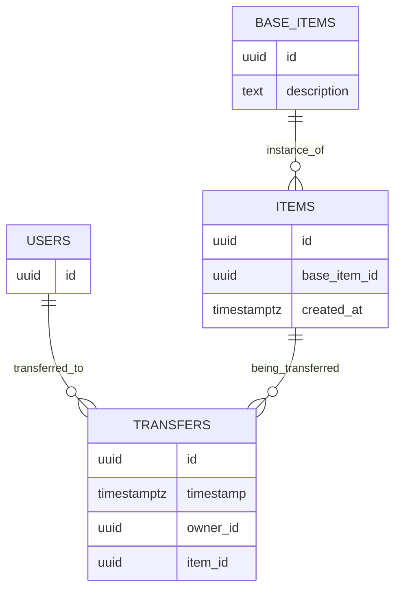

- [About](#about)
- [Data Model](#data-model)
- [Notification Flow](#notification-flow)
- [What I want to show](#what-i-want-to-show)
- [Room for improvement](#room-for-improvement)
- [Local Development Setup](#local-development-setup)


# About 
This solution consists of a backend service ("server") providing statistics to one or many clients ("dashboard"). The server interacts with a database ("database"). This database 1) stores the data (see [Data Model](#data-model)) and 2) acts as a Message Broker to notify the system of updates (see [Notification Flow](#notification-flow)). Additionally, the server runs a one REST-API for simple inserts of new data and one [SSE-server](https://developer.mozilla.org/en-US/docs/Web/API/Server-sent_events/Using_server-sent_events) to push updates to the dashboard. 

# Data Model
The datamodel aims to create a relatively simple interface for answering 1) how many transfers occur and 2) how many items are created. There is no direct relationship between an `item` and a `user`. Rather, ownership is determined association with the latest `transfer.timestamp`. In this way, this model can be said to track events rather than maintaining a "current state". 




# Notification Flow 
This solution uses `NOTIFY`/`LISTEN` in postgres (through [pg-listen](https://github.com/andywer/pg-listen)) to publish and subscribe to events about 1) user creation and 2) transfers. Whenever an item is created, a notification is published on `Channel.ITEM_CREATION` and similarly a notification is published on `Channel.ITEM_TRANSFER` on an item transfer. 

In parallel (could've be a separate service), the server listens to these events, when the occur, pushes updated statistics to all subscribed clients in the resolution they've subscribed to (e.g. `minute`, `month` etc.) (see `src/server-side-events.ts`).

# What I want to show 
* a data model lending itself to answering the questions being asked 
* pushing live updates to the clients using [server-sent events](https://developer.mozilla.org/en-US/docs/Web/API/Server-sent_events/Using_server-sent_events)
* building a pub-sub architecture for events, using postgres as a message broker 

# Room for improvement
* Thorough automated tests 
* not store clients in memory
* security does not exist 
* input validation hardly exists 
* no time spent on GUI
* frontend lacks typing 
* stronger typing in backend
* organization of modules leaves some things to be desired
* server-side-events only pushes _updates_ to statistics, not an entire new payload

# Local Development Setup 
The system expects a local `.env` file with the following environment variables: 
```
# values can be swapped 
SERVER_PORT=8080 
DASHBOARD_PORT=8082
PGPORT=5432 
PGDATABASE=newcycle 
PGUSER=user 
PGPASSWORD=password 
```
Assuming you have [Docker Compose](https://github.com/docker/compose) installed, it should be enough to run `docker compose up -d` to start 1) the database, 2) the server and 3) the dashboard frontend. The server and dashboard are available at  `http://localhost:<YOUR_SERVER_PORT>` and `http://localhost:<YOUR_DASHBOARD_PORT>` respectively. 